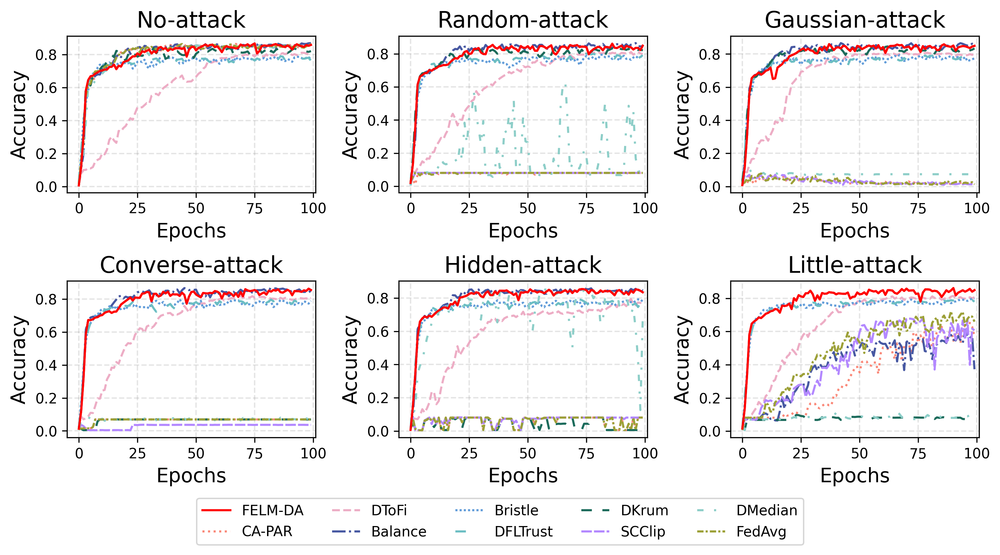

# Byzantine-Robust Decentralized Federated Learning based on Feature Extraction Layer Measuring and Delayed Aggregation

## 🎉Getting started!!!

### Requirements

To install requirements:

```bash
pip install -r requirements.txt
```

### Datasets

The Fahion-MNIST and CIFAR-10 datasets require no additional setup and will be automatically downloaded  upon the first execution of the code. For the FEMNIST dataset, please refer to the LEAF repository available at: https://github.com/TalwalkarLab/leaf.

e.g.:

```bash
git clone https://github.com/TalwalkarLab/leaf.git
# generate FEMNIST
cd leaf/data/femnist
./preprocess.sh -s niid --sf 0.1 -k 0 -t sample --tf 0.8 --spltseed 42
```

To generate more than 35 clients using the FEMNIST dataset, it is necessary to modify the `MAX_WRITERS` parameter in the script located at `leaf/data/femnist/preprocess/data_to_json.py`.

## 🤖Training

🚀Run `train.py` with a choice of the following tags:

- `--epochs` := total number of training epochs; default is 50; ✨**RECOMMENDED:** FashionMNIST set 50, FEMNIST set 100, CIFAR10 set 150.
- `--dataset` := the dataset used; 📋**OPTIONS:** FashionMNIST, FEMNIST, CIFAR10.
- `--batch_size` := the number of training samples; default is 256.
- `--meta_lr` := learning rate; default is 1e-3.
- `--nodes_n` := total number of clients in DFL; default is 10.
- `--byzantine_ratio` := the probability of being a Byzantine client, e.g., `--byzantine_ratio 0.3` represents that in the topology, each client has a $30\%$ probability of being a Byzantine client; default is 0.3.
- `--connection_ratio` := the probability of being connected, e.g., `--connection_ratio 0.3` represents that in the topology, any pair of clients have a $30\%$ probability of being connected; default is 0.5.
- `--attack` := attacks employed by Byzantine clients; 📋**OPTIONS:** random, gaussian, converse, hidden, little; default is gaussian.
- `--par` := aggregation methods used by benign clients; 📋**OPTIONS:** felm_da, tofi, bristle, krum, median, qc, balance, fltrust, scclip, avg.
- `--logdir` := storage path for benign node accuracy.
- `--noniid_rate` := Non-IID degree $\alpha$; default is 0.5.

e.g.:

```bash
python train.py --epochs 100 \
				--dataset "FEMNIST" \
				--attack "little" \
				--par "felm_da" \
				--logdir "felm_da/femnist/little-attack"
```

## 🤩Results


